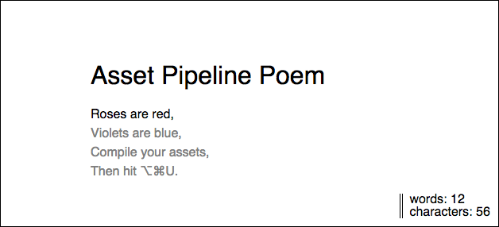

# Asset Pipeline Poem

| **Objectives** |
| :---- |
| Explore the assets pipeline in rails |
| Practice structuring require statements |
| Precompile compressed javascript assets |

**Terms:**

- Manifest
- Pre/compilation
- Concatenation
- Compression / Minification
- Browser Caching
- MD5 fingerprint

##Instructions:
Your goal is to reconstruct a simple poem.

- Clone this repo
    + Note that this rails app does not have a database.
- Run your server and open "/". You should see a jumbled poem.

When you're done make changes, the homepage should look like this (with the poem in the correct order and styled correctly):

#### Rules
* You are not allowed to modify any files.
* You are only allowed to update the manifests in:
    * `app/assets/javascripts/application.js`
        - e.g. `//= require roses-are-red`
    * `app/assets/stylesheets/application.css`
        - e.g. `*= require layout`
* Try not to use `require_tree .` anywhere.

## Part 1. Using the Asset Pipeline
The assets you want live in the following locations, inside of your rails application directory:

    app/                    # application specific code
        assets/
            images/
            javascripts/
            stylesheets/
    lib/                    # custom libraries
        assets/
            javascripts/
            stylesheets/
    vendor/                 # third party libraries
        assets/
            javascripts/
            stylesheets/

Each directory has a specific use-case. The files you want are scattered across them. Your goal is to find all the files and require them in the correct order!

##Bonuses:
Note that bootstrap.js is being included using a CDN. It's a quick and dirty way of including it, but let's save it locally:

1. Find and copy the current bootstrap.js url (see `views/layouts/application.html.erb`)
2. `cd vendor/assets/javascripts/`
3. `curl -vs BOOTSTRAP_JS_URL > bootstrap.js`
4. Finally, delete the old cdn link, and "require" the new bootstrap in your `application.js` manifest.

##Reading
http://guides.rubyonrails.org/asset_pipeline.html
https://github.com/rails/sprockets#sprockets-directives
